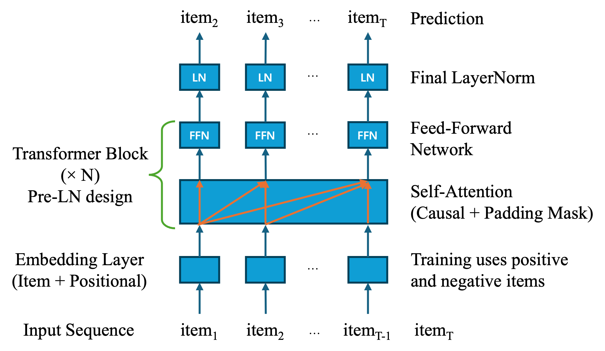

## SASS Robot Cat
`Robotics` | `Computer Vision` | `Speech Recognition` | `Actuator Control` | `Human-Robot Interaction`

- Built a ROS 2 robotic cat integrating vision, speech, navigation, and actuator control.
- Implemented person following, object search, autonomous docking, and state-based behaviors.
- Added expressive head, ear, and sound responses for interactive human-robot interaction.

<p><a href="https://www.youtube.com/watch?v=wJvU7m090wQ">Video</a> | <a href="https://github.com/ssswzh/SASS_cat">Code</a> </p>

```{=html}
<div class="img-container" style="display: flex; gap: 2px; align-items: flex-start;">
  
  
  
</div>
```


## Reinforcement Learning Algorithms for CartPole Problem
`Reinforcement Learning` | `Deep Q-Network` | `Actor Critic` | `A2C` | `Proximal Policy Optimization`

- Implemented Naive DQN, REINFORCE, AC, A2C, and PPO in CartPole environment. 
- Several engineering tricks were applied to improve performance and stability, including mini-batch update, multiple epochs, generalized advantage estimation (GAE), advantage normalization and entropy regularization. 
- PPO achieves the best overall performance, reaching the maximum return quickly and maintaining the most stable learning curve. 
- Clipped policy updates, variance reduction, and practical implementation techniques such as GAE and mini-batch optimization are important for stable policy learning.
- The transition from value-based to policy-based to advanced policy-based methods suggests the evolution of reinforcement learning methods on providing greater flexibility and more expressive decision-making strategies.

```{=html}
<div class="img-container" style="display: flex; justify-content: flex-start; gap: 10px; align-items: flex-start;">
  
</div>
```


## Recommendation Challenge for Amazon Products
`Recommendation System` | `Sequential User Behavior` | `SASRec` | `BERT4Rec` | `LightGCN`

- Built a Top-10 Amazon product recommender for a Kaggle competition, evaluated by Recall@10.
- Compared SASRec, BERT4Rec, SASRec+, and LightGCN on temporally ordered user sequences.
- Designed a multi-stage pipeline with metadata-based candidate filtering and SASRec ranking.
- Ranked 8th/60 on the Kaggle leaderboard with the final SASRec-based recommendation system.

<p><a href="https://www.kaggle.com/competitions/recommender-system-challenge-2526-s-2/overview">Kaggle</a>
```{=html}
<div class="img-container" style="display: flex; justify-content: flex-start; gap: 10px; align-items: flex-start;">
  
</div>
```


## Evolutionary Algorithm on Black-box Problems
`Genetic Algorithm` | `Evolutionary Strategy` | `Optimization` | `Black-box Problems`

- Implemented Genetic Algorithm (GA) and self-adaptive $(\mu,\lambda)$ Evolution Strategy (ES) from scratch for discrete and continuous optimization.
- Applied GA to [LABS and N-Queens](https://iohprofiler.github.io/IOHexp/) [@IOHprofiler;@IOHanalyzer;@IOHexperimenter], and ES with log-normal step-size adaptation to the Katsuura problem.
- Designed a budget-aware, step-wise hyperparameter tuning strategy to efficiently identify promising configurations.
- Evaluated convergence and robustness using EAF, ECDF, and Expected Runtime (ERT) across multiple runs.

